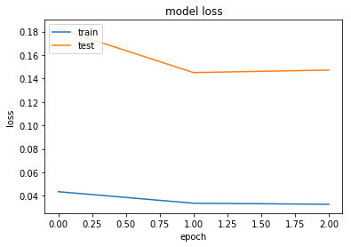
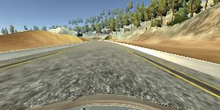
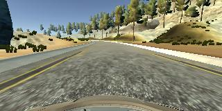

# Behavioral Cloning

The goals / steps of this project are the following:

Use the simulator to collect data of good driving behavior
Build, a convolution neural network in Keras that predicts steering angles from images
Train and validate the model with a training and validation set
Test that the model successfully drives around track one without leaving the road

My project includes the following files:

model.ipynb containing the script to create and train the model
drive.py for driving the car in autonomous mode
model.h5 containing a trained convolution neural network
writeup_report.md  summarizing the results

The model.ipynb file contains the code for training and saving the convolution neural network. The file shows the pipeline I used for training and validating the model, and it contains comments to explain how the code works.

### Model Architecture and Training Strategy

##### Architecture
My model consists of a convolution neural network with 3x3 filter sizes and depths between 24 and 64 (model.ipynb ln 5)

The model includes RELU layers to introduce nonlinearity, and the data is normalized in the model using a Keras lambda layer.

Following table represnts the model architecture generated by Keras: model.summary()

|Layer (type)                    | Output Shape         | Param #   | Connected to         |

| :-------------: | :-------------:|:-------------:|:-------------:|

|lambda_5 (Lambda)               | (None, 160, 320, 3)  | 0         |  lambda_input_5| 

|cropping2d_5 (Cropping2D)       | (None, 65, 320, 3)   | 0         |  lambda_5     |

|convolution2d_21 (Convolution2D)| (None, 31, 158, 28)  | 2128      |  cropping2d_5 | 

|convolution2d_22 (Convolution2D)| (None, 14, 77, 36)   | 25236     |  convolution2d_21 | 

|convolution2d_23 (Convolution2D)| (None, 5, 37, 48)    | 43248     |  convolution2d_22 |

|convolution2d_24 (Convolution2D)| (None, 3, 35, 64)    | 27712     |  convolution2d_23 |

|convolution2d_25 (Convolution2D)| (None, 1, 33, 74)    | 42698     |  convolution2d_24|

|flatten_5 (Flatten)             | (None, 2442)         | 0         |  convolution2d_25| 

|dense_21 (Dense)                | (None, 200)          | 488600    |  flatten_5 |  

|dropout_1 (Dropout)             | (None, 200)          | 0         |  dense_21 | 

|dense_22 (Dense)                | (None, 150)          | 30150     |  dropout_1|  

|dropout_2 (Dropout)             | (None, 150)          | 0         |  dense_22| 

|dense_23 (Dense)                | (None, 50)           | 7550      |  dropout_2|

|dropout_3 (Dropout)             | (None, 50)           | 0         |  dense_23|  

|dense_24 (Dense)                | (None, 50)           | 2550      |  dropout_3|  

|dense_25 (Dense)                | (None, 1)            | 51        |  dense_24|                   

Total params: 669,923
Trainable params: 669,923
Non-trainable params: 0

##### Attempts to reduce overfitting in the model

The model was trained and validated on different data sets to ensure that the model was not overfitting. The model was tested by running it through the simulator and ensuring that the vehicle could stay on the track.

Following plot depicts the loss of network through trainign process.

[image1]: 

##### Model parameter tuning

The model used an adam optimizer, so the learning rate was not tuned manually.

##### Appropriate training data

Training data was chosen to keep the vehicle driving on the road. I used a combination of center lane driving, recovering from the left and right sides of the road, usin the left and right camera data. 

Following are some examples of our training data.

[image2]: 

[image3]: 

#### 1. Solution Design Approach

My first step was to use a convolution neural network model similar to the Nvidia model. In order to gauge how well the model was working, I split my image and steering angle data into a training and validation set. I found that my first model had a low mean squared error on the training set but a high mean squared error on the validation set. This implied that the model was overfitting.

To combat the overfitting, I modified the model by using the images available from both left and right camera. I also normalized the data before trainign. Furthermore, I collected more data from both driving paths available in the simulator 

At the end of the process, the vehicle is able to drive autonomously around the track without leaving the road.
